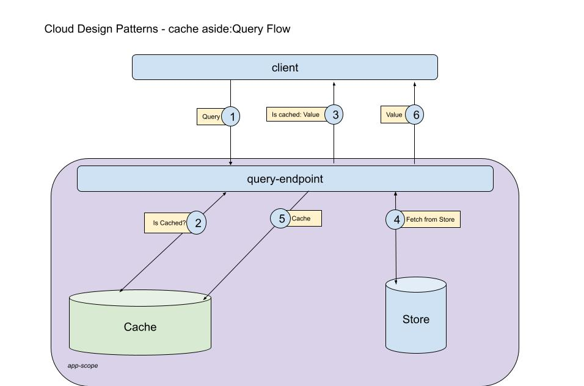
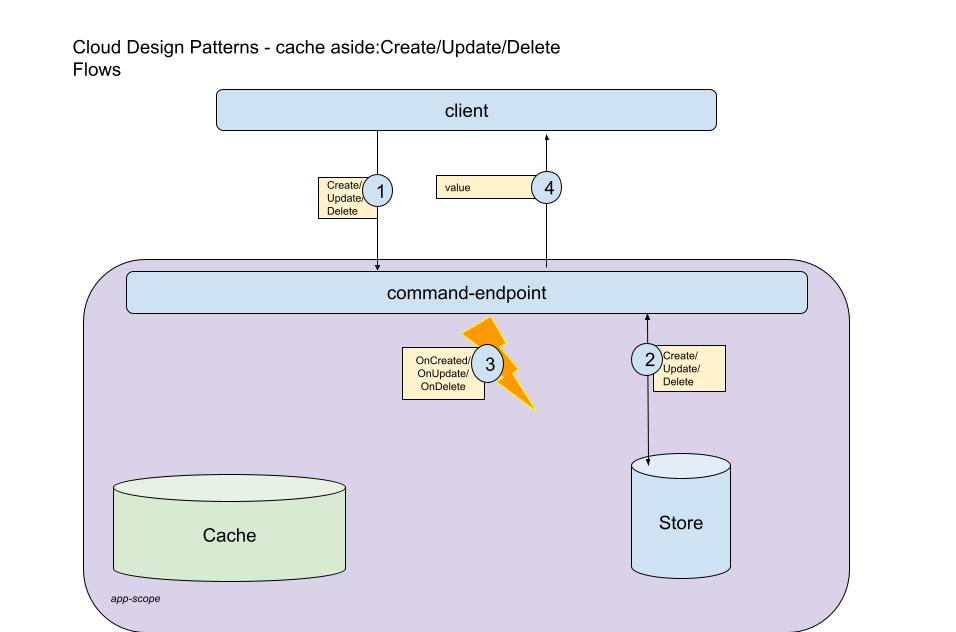

# Cache-Aside
`Cache-Aside` design pattern improve performance and usibility for reading data from a store by placing the fetched data into in-memory-store (cache) for re-use.
It is related to [Data Flow Management](../README.md#data-flow-management).

Upon request for stored data `cache-aside` perffroms the following steps:
1. Is the fetched data exists in cache?
2. If yes - the cached value is returned as request's result
3. If no:
4. Fetches the data from the store
5. Place the fetches value into cache
6. Return the fetched value as request's result

## When (partial)
* Same data-value is required
* Fetching data is "expensive" operation
* Data-value size can be accommodated within cache 

## CRUD - Managing entry lifecycle using cache-aside
When an item is to set into or get from cache, a unique identifier must be generated (cache-key).
While reading data behavior acts as describe above, create/update/delete actions have different behavior.
The general flow for Create/Update/Delete should be:
1. Modify store
2. Raise event for create/update/delete
3. Return the fetched value as request's result

An event handler should handle cache management with the commone behavior of:
* `OnCreate` - Remove all same entry type from cache - to cause cache update for `get-all` action
* `OnUpdate` - Remove all same entry type from cache - to cause cache update for `get-all` and `get-single-entry-by` actions
* `OnDelete` - Remove all same entry type from cache - to cause cache update for `get-all` actions and eliminate the result for `get-single-entry-by` action

## How to Manage Cache for Multiple Application Instances
Central cache that updates local cache
