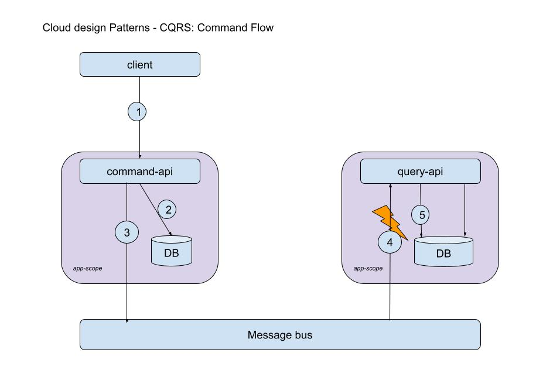

# CQRS
`CQRS` design pattern separates the domain to entity update and read operations.
By providing separate endpoints and logic for each you may optimize the usage of your service.

The implementaion created here is described in the following images:

