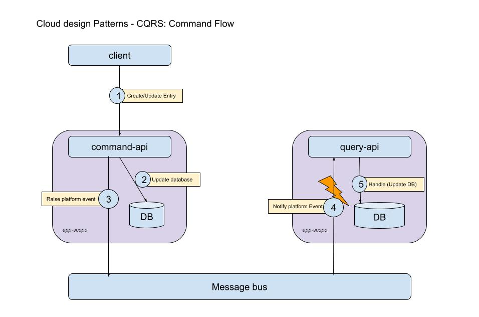
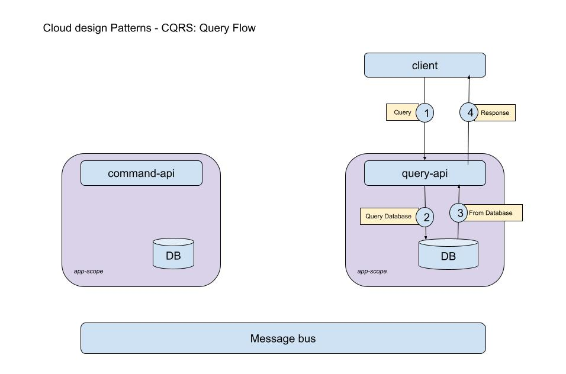

# CQRS
`CQRS` design pattern separates domain's entity update and read operations.
By providing separate logic for each operation cross-domain-optimization is achieved.

The implementaion provided is described in the following images:

## Implemented Domain and story
The example is for an online marketplace product management and implementats 3 services:
* `IdentityServer` - Utilizes  for identity management
* `CommandAPI` - Command endpoint(s)
* `QueryAPI` - Query endpoint(s)

The services are:
### 1. `CommandAPI` - Product Administration Service
This service providing product owner to adminitrate products over multiple aspects such inventory management, ordering, SEO and analytics, etc.
And also "exposes" the products to marketplace search engine
Whenevent product is created/updated all attribute and data related to these aspects are managed by product administrator

### 2. `QueryAPI` - Marketplace's Product Search Service
This service recieves product search query from a marketplace app and returns the matching results
